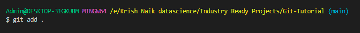
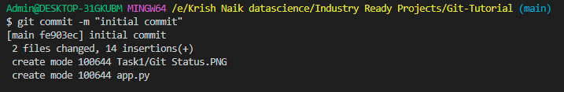
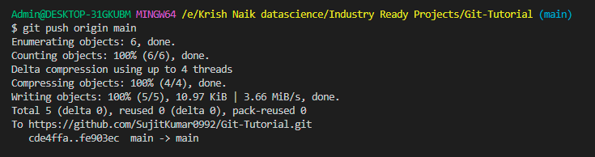

## 3. Git status
```
git status
```
Example


Shows information about the current changes ( new files added, updated, deleted, renamed etc)

## 4. Git Add
```
git add .
```
Adds all the current changes to the staging area.

```
git add <filename>
```
Adds the specic file to the staging area.
Example


## 5. Commit
```
git commit -m "Commit messege"
```
Example


Commits the changes

## 6. Push

```
git push origin main
```
Example


Push the changes in the staging area to the remote main branch. We can replace the main branch with any other branch name.
